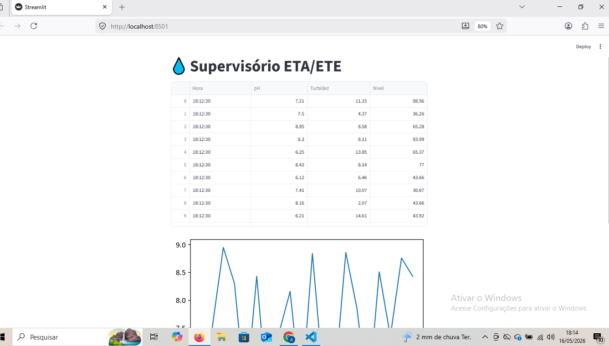

# 💧 Supervisório ETA/ETE

Sistema supervisório desenvolvido em Python para monitoramento simulado de parâmetros operacionais em estações de tratamento de água e efluentes.

---

## 📷 Dashboard



---

## 🚀 Tecnologias Utilizadas

- Python
- Streamlit
- Pandas
- Matplotlib

---

## 📊 Funcionalidades

- Monitoramento de pH
- Monitoramento de turbidez
- Monitoramento de nível
- Geração de gráficos
- Dashboard web interativo

---

## ⚙️ Como executar

Clone o projeto:

```bash
git clone https://github.com/andersonrock2496-ops/DIO_bootcamp.git